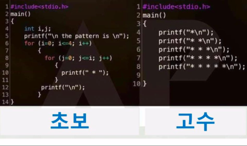

## Create Phone Number
https://www.codewars.com/kata/514b92a657cdc65150000006

### 문제
Write a function that accepts an array of 10 integers (between 0 and 9), that returns a string of those numbers in the form of a phone number.

Example
```
createPhoneNumber([1, 2, 3, 4, 5, 6, 7, 8, 9, 0]) // => returns "(123) 456-7890"
```
The returned format must be correct in order to complete this challenge.
Don't forget the space after the closing parentheses!


### 풀이
#### 내가 짠 코드
```javascript
function createPhoneNumber(numbers){
    var str = "";
    numbers.splice(0, 0, '(');
    numbers.splice(4, 0, ') ');
    numbers.splice(8, 0, '-');
    return numbers.join('');
}
```
`.splice`로 `numbers` 배열 중간에 `(`, `) `, `-` 를 추가해주고 `.join`으로 문자열로 변환해주면 끝


이번에도 다양한 방법의 <a href="https://www.codewars.com/kata/525f50e3b73515a6db000b83/solutions/javascript" target="_blank">솔루션</a>들이 존재하지만 쓸데없이 길고 복잡한 코드를 볼 때면 예전에 봤던 이 짤이 생각난다. ㅋㅋㅋ



아무튼 이번 문제도 그냥 별 생각 없이 쉽게 푼 것 같다ㅋㅋ